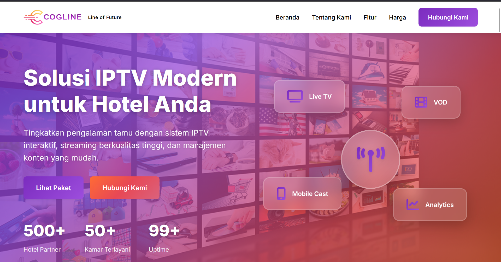
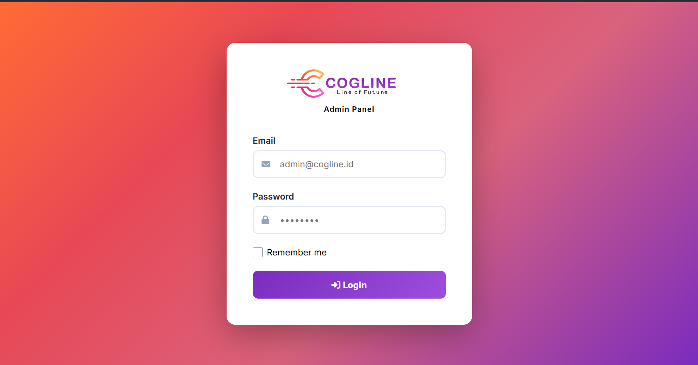

# CoglineTech IPTV Service Website

Website layanan **IPTV (Internet Protocol Television)** yang dikembangkan menggunakan **Laravel Framework**.  
Aplikasi ini menyediakan **website layanan IPTV berbasis web** dengan **sistem admin** untuk mengelola konten, layanan, dan informasi yang ditampilkan kepada pengguna.

Project ini ditujukan sebagai **company service website** yang memudahkan pengelolaan layanan IPTV secara terpusat melalui dashboard admin.

---

## 🎯 Fitur Utama

### 🖥️ User Side
- Informasi layanan IPTV
- Halaman landing & company profile
- Tampilan responsif (desktop & mobile)
- Halaman autentikasi pengguna

### 🔐 Admin Panel
- Sistem login admin
- Manajemen konten website
- Pengelolaan halaman utama
- Manajemen data layanan IPTV
- Update konten tanpa mengubah kode

---

## 🛠️ Tech Stack
- **PHP >= 8.1**
- **Laravel Framework**
- **MySQL Database**
- **Blade Template Engine**
- **CSS / Bootstrap**
- **JavaScript**

---

## 🚀 Installation & Setup

Ikuti langkah berikut untuk menjalankan project secara lokal.

### 1. Clone Repository
```bash
git clone https://github.com/Dedenmhmmd7/coglinetech.com.git
cd coglinetech.com
 
composer install
npm install

cp .env.example .env
php artisan key:generate


Atur konfigurasi database di file .env:

DB_DATABASE=your_database
DB_USERNAME=your_username
DB_PASSWORD=your_password

php artisan migrate

Jalankan Aplikasi
php artisan serve


Akses aplikasi melalui:

http://127.0.0.1:8000


## 📸 Screenshot

### Homepage


### Login Page

